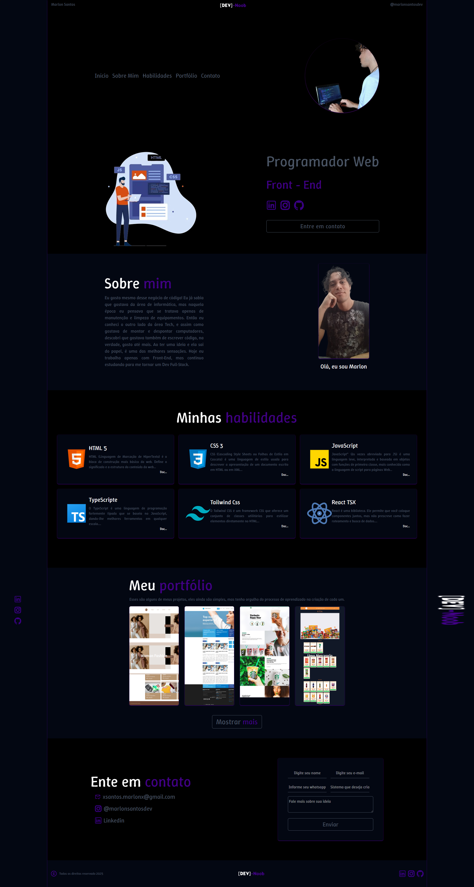
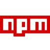

This is a [Next.js](https://nextjs.org) project bootstrapped with [`create-next-app`](https://nextjs.org/docs/app/api-reference/cli/create-next-app).

## Getting Started

First, run the development server:

```bash
npm run dev
# or
yarn dev
# or
pnpm dev
# or
bun dev
```

Open [http://localhost:3000](http://localhost:3000) with your browser to see the result.

You can start editing the page by modifying `app/page.tsx`. The page auto-updates as you edit the file.

This project uses [`next/font`](https://nextjs.org/docs/app/building-your-application/optimizing/fonts) to automatically optimize and load [Geist](https://vercel.com/font), a new font family for Vercel.

## Learn More

To learn more about Next.js, take a look at the following resources:

- [Next.js Documentation](https://nextjs.org/docs) - learn about Next.js features and API.
- [Learn Next.js](https://nextjs.org/learn) - an interactive Next.js tutorial.

You can check out [the Next.js GitHub repository](https://github.com/vercel/next.js) - your feedback and contributions are welcome!

## Deploy on Vercel

The easiest way to deploy your Next.js app is to use the [Vercel Platform](https://vercel.com/new?utm_medium=default-template&filter=next.js&utm_source=create-next-app&utm_campaign=create-next-app-readme) from the creators of Next.js.

Check out our [Next.js deployment documentation](https://nextjs.org/docs/app/building-your-application/deploying) for more details.

## Meu Portfólio
<a href='https://meuportfolio-beta-rosy.vercel.app/'>
    
</a>

# Sobre esse projeto 💾
Este projeto tem um objetivo falar um pouco sobre mim e mostrar alguns dos projetos que já fiz e que continuo fazendo.

# Ferramentas utilizadas 🛠️
<div>
<h2 style='color:gray;'>Linguagens de programação</h2>
    <a style='text-align:center;' href='https://developer.mozilla.org/pt-BR/docs/Web/JavaScript/'>
        <h2>JavaScript</h2>
         </br>
        <small style='margin-left:1rem;'>Documentação</small>
    </a>

<a style='text-align:center;' href='https://www.typescriptlang.org/'>
    <h2>TypeScript</h2>
     </br>
    <small style='margin-left:1rem;'>Documentação</small>
</a>
</div>

<div>
    <h2 style='color:gray;'>Bibliotecas</h2>
    <a style='text-align:center;' href='https://www.typescriptlang.org/'>
        <h2>React</h2>
         </br>
        <small style='margin-left:1rem;'>Documentação</small>
    </a>

<a style='text-align:center;' href='https://www.npmjs.com/package/react-toastify?activeTab=readme'>
    <h2>React-Toastify</h2>
     </br>
    <small style='margin-left:1rem;'>Documentação</small>
</a>

</div>

<div>
<h2  style='color:gray;'>Framework</h2>
<a style='text-align:center;' href='https://tailwindcss.com/'>
    <h2>Tailwindcss</h2>
     </br>
    <small style='margin-left:1rem;'>Documentação</small>
</a>
</div>

<div>
<h2  style='color:gray;'>Software Development Kit / SDK</h2>

<a style='text-align:center;' href='https://www.emailjs.com/docs/tutorial/overview/'>
    <h2>EmailJs</h2>
     </br>
    <small style='margin-left:1rem;'>Documentação</small>
</a>
</div>

##